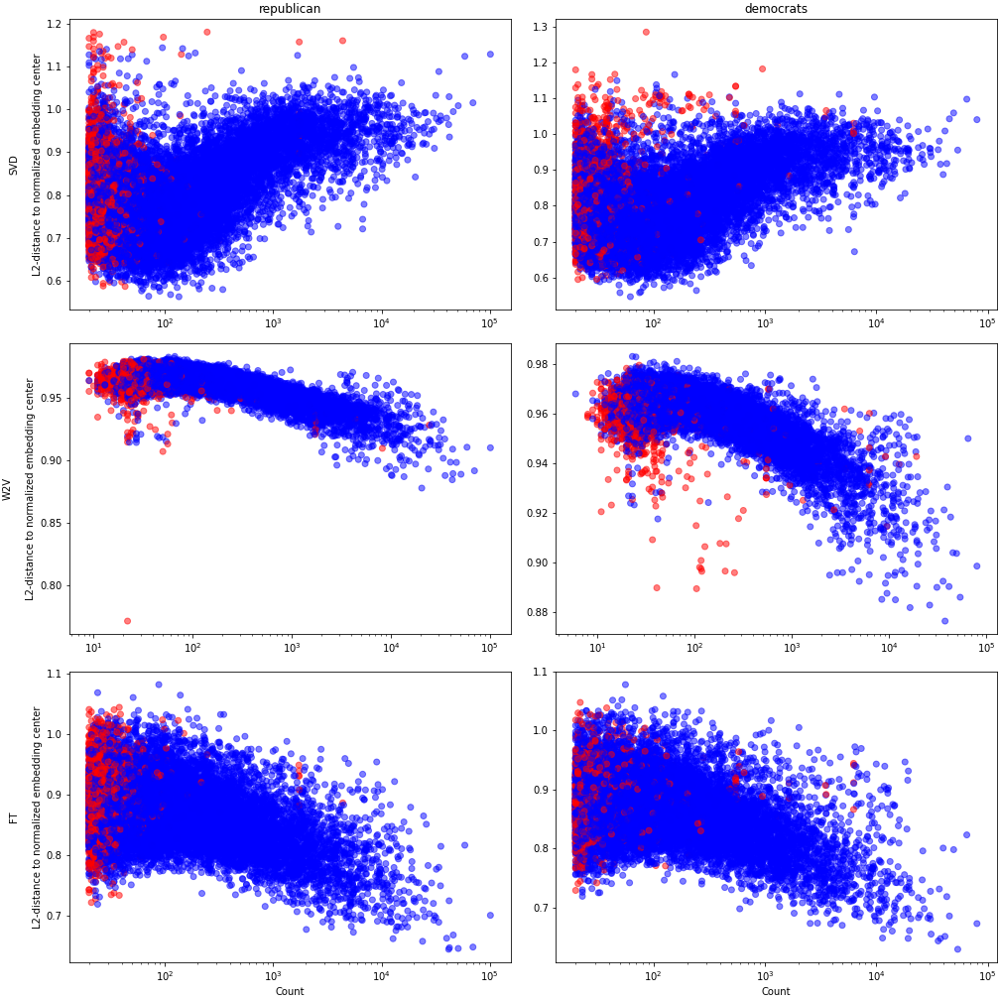

# Embedded Understanding
Research project carried out by Thyge Enggaard under the supervision of Sune Lehmann and Morten Axel Pedersen. 

<!-- https://ecotrust-canada.github.io/markdown-toc/ -->

- [Studying contested meaning](#studying-contested-meaning)
- [Methodological approaches](#methodological-approaches)
- [Embedding choices and validation](#embedding-choices-and-validation)
  * [Corpus preprocessing](#corpus-preprocessing)
  * [Embedding parameters](#embedding-parameters)
  * [Stochatic embeddings](#stochatic-embeddings)
- [Empirical analysis so far](#empirical-analysis-so-far)
  * [Data](#data)
  * [Pre-processing of comments](#pre-processing-of-comments)
  * [Embeddings](#embeddings)
  * [Alignment](#alignment)
  * [Embedding properties and alignment](#embedding-properties-and-alignment)
    + [The static embeddings correlates frequency and centrality (vector length)](#the-static-embeddings-correlates-frequency-and-centrality--vector-length-)
    + [The rotation alignment correlates centrality and aligned distance](#the-rotation-alignment-correlates-centrality-and-aligned-distance)

# Studying contested meaning
Apparently, ~500m tweets are tweeted on Twitter per day, and ~2m comments are made on Reddit per day. For social scienties interested in studying what is being said (and debated, and misunderstood, and...) this pose a significant challenge to methods based on reading a corpus end-to-end.   

One option is to initially enter the corpus through a focus on particular words, that the researcher expects to be central for what is taking place. Local semantic networks or embedding projections might then help the researcher get a sense of which other words the targeted word is being used in relation to.

But is it possible to formalize certain properties of such 'interesting' words and identify them accordingly? That is, as opposed to specifying certain words in advance, is it possible to specify certain criteria that characterizes what makes them interesting? 

In this project, I will attempt to formalize computational methods, that can identify words, that are understood most differently between two corpora, although they apparently seem to refer to the same. More specifically, I will attempt to utilize word embeddings to elicit differences in how words are used, and subsequently explore whether this can be interpreted as differences in understanding.

Polysemy (many-sign, many meanings or significations) is sometimes 'reduced' to a set of disjoint contexts (e.g. apple reffering to either a fruit or a company). But even for one of these options (e.g. apple as a company), how different people understand what apple is might be very polysemic. This does not refer to ones sentiment towards apple (whether one supports, barely knows of or hates apple products, although it might be related), but to the very way in which apple is understood by the subject using the word.

One might e.g. expect that what apple is on r/Capitalism is different from what it is on e.g. r/Socialism or r/Technology. Such difference might at first not seem to hinder debates and discussions - they do to some degree all agree on what apple points out or refers to (what it denotes). But these differences might nonetheless represent what could tentatively perhaps be called dis-understanding; situations in which the 'real' reference seem agreed upon, yet what that reference is, is contested.

Literature/concepts, that might be relevant:
* Floating signifier (Levi-Strauss)
* Heteroglossia (Bakhtin)

# Methodological approaches

The idea I have pursued so far is a 'direct, global' comparison of two static embeddings:
* Train two static embedding, on each of two corpora 
* Align the embeddings, by rotating one of the embeddings to best match the other (orthogonal transformation)
* Identify words with highest and lowest aligned distance

I have also considered the following alternatives:
1. Indirect, static comparison of two embedding (i.e. measures that do not require alignment)
    1. Indirect, global comparison: For each word, calculate its distance to all other words in each embedding and compare distances (e.g. avg. difference)
    1. Indirect, local comparison: For each word, compare the local neighborhoods, e.g. the overlap among the N nearest neighbors in each of the embeddings
1. Dynamic embedding of single corpus: 
    1. Obtain a representation of each token of each word type in the combined corpus, from a pretrained, dynamic embedding (e.g. from BERT, perhaps with finetuning)
    1. Cluster the word representations for each type (to capture disjoint context such as apple (fruit) and apple (company). That is, each word is now split up into multiple, 'disjoint' senses.
    1. For each cluster (word sense), calculate a measure of dispersion - highly dispersed clusters would be candidate words
    1. One advantage, is that after this, one could make a targeted local projection based on the word sense and not just the word type.
    1. One disadvantage is that the dispersion might not relate to between-corpora differences, but could be due to within-corpus effects. This would still be interesting, particular if I can somehow couple this to authors/subreddits.  
1. Dynamic embedding of two corpora:    
    1. Similar to first three steps for the dynamic embedding of single corpus - clusters obtained across corpora, to ensure they are shared
    1. Splitting by corpora, each token is then assigned to the nearest cluster
    1. Instead of calculating cluster dispersion, this would for each cluster (each sense of each word) then measure the distance between the clusters in the two corpora.
    
Unfortunately (in terms of being new) / encouraging (in terms of being feasible and promising), something along the lines of the dynamic options above has was published last year: [Analysing Lexical Semantic Change with Contextualised Word Representations](https://www.aclweb.org/anthology/2020.acl-main.365/) 

# Embedding choices and validation

The embedding of a corpus is an attempt to represent (semantic) similarities between words based on the distribution (co-occurence) of words in the corpus. Here, I will briefly elaborate on three aspects of embeddings, and how validation might look, when the focus is to represent a particular corpus as well as possible (as opposed to say generalize the embedding to be usable in different settings):
1. Corpus preprocessing prior to embedding
1. Deciding embedding parameters
1. Assessing the effect of the (potentially) stochastic nature of embeddings   

## Corpus preprocessing
Embedding the 'raw' corpus can pose various technical challenges (e.g. rare words, large vocabulary). Many pre-processing steps can be applied, e.g. removing words deemed 'unimportant' (often so called stop words), lemmatizing/stemming words, removing words with few characters and/or removing numbers.

While some choices might be analytically motivated (such as splitting words based on their part-of-speech or grammatical tense or voice), this will often not resolve all these choices.      

## Embedding parameters
Training word embeddings require making choices in two areas:
1. Embedding architecture: There are many ways to obtain embeddings. At a high-level, I distinguish between embeddings that are static (e.g. (SVD-)PPMI, SGNS, Fasttext, Glove) and contextual/dynamic (e.g. BERT). Within each of these, many other considerations apply, such as whether the embedding should consider subword-information (e.g. Fasttext) or not (e.g. SGNS).
1. Hyper parameters for the chosen architecture: Training word embeddings requires determining multiple hyper parameters in advance.
    1. Architecture parameters: The model for transforming words to vectors often involve several parameters. A common one is the window-size - how close (in number of tokens) must to word-types be in order to count as associated.
    1. Learning paramters: In addition, the learning procedure entails hyper parameters, such the number of epochs (the number of times the corpus is ingested) or the learning rate (how 'aggressively' the model updates its internal parameters).

Ideally, choices regarding preprocessing (that is not analytically motivated) and embedding paramters should be made based on an understanding of how each decision affects the properties of the embedding for the particular corpus and research question. To the best of my (limited) knowledge, there is however still significant uncertainty about many of these relations, as well as how they vary with the corpus. 

Hence, these choices are often made:
* Based on how well they have worked in other applications. This raises the question of how appropriate they are for a given corpus. As many of these observations are made by the Natural Languace Processing (NLP) community, which in turn (to my current understanding) often work on fairly large corpora, one might in particular worry whether the size of the corpora changes these results.      
* By applying different options on the given corpus and comparing the results. This raises questions of computational feasibility, as the number of joint paramter configurations is often beyond what can be applied in reasonable time.  

## Stochatic embeddings
In addition to these explicit choices (often made implicit through default settings), word embeddings are stochastic - several of the steps involved rely on randomization (e.g. the initial allocation of word vectors, sampling of word pairs in a batch - this is not the case for PPMI embeddings). This leads to instability - applying the same set of choices multiple times will likely not lead to identical embeddings.

The most obvious approach to assessing how this stochasticity affects the 'results' is to make multiple embeddings (with corpus preprocessing and embedding parameters fixed). Beyond computational limits, this then raises questions of how to compare embeddings (obtain results for each, or integrate multiple embeddings into one?) as well as how to proceed, if one is interested in multiple results.   

# Empirical analysis so far

## Data
I currently apply my ideas to two corpuses, consisting of (almost) all comments in the subreddit r/Republican and r/Democrats.

## Pre-processing of comments
Currently, I preprocess as follows: 
* Remove comments that display as removed by the user
* Remove a few obvious bot comments
* Replace urls and usernames with a REM-token
* Remove 'r/' from subreddit names
* Replace underscore with space    
* Replace '!', '?' and '\n' (newline) with a dot ('.')
* Replace characters, that are neither letter or digit with space
* Remove multiple spaces
* Remove multiple dots
* Tokenize the text (currently using the crazy-tokenizer developed for reddit, based on spaCY - https://redditscore.readthedocs.io/en/master/tokenizing.html)
* Parse the tokenized text for lemma and part-of-speech (POS) (currently using Stanza - https://stanfordnlp.github.io/stanza/)
* Lemmatize and lowercase words
* Replace stop words and single-character words a REM-token     
* Append the POS-tag to each word ('dog' transformed to 'dog_NOUN')

Further, I subset the vocabulary, by dropping words that appear less than 20 times.
    
TO DO
* Find a principled way to filter out bot comments
    * Option \#1: Identify groups of comments with high similarity (e.g. TF-IDF) and remove if they are from bots --> not feasible 

  
## Embeddings
I have obtained the following embeddings:
* SVD-PPMI
* Skip-gram with negative sampling (SGNS-version of word2vec), based on the Gensim-library
    * Selected parameters: size=300, window=5, min_count=20, negative(samples)=20 
* FastText
    * Selected parameters: Same as above, min_n(character n-gram length)=3, max_n=6
    
TO DO:
* Validate embedding stability
    * For hyperparameter setting: ?
    * For stochasticity: Run multiple embeddings, align and take average?

## Alignment
Obtaining the optimal, distance-preserving rotation (i.e. the rotation that yields the lowest avg. rotated distance) is known as the Orthogonal Procustes Problem:
* Let E_r and E_d denote the unrotated republican and democratic embeddings respectively
* Let U, V.T be the matrixes obtained from the svd of the product of the embeddings, i.e. E_d.T x E_r = U x S x V.T
* The rotation matrix R, that minimizes the distance between E_r and E_d x R, has the analytical solution R = U x V.T 

TO DO
* Consider using the same distance measure when training the embedding and aligning the rotation 

## Embedding properties and alignment
    
Based on initial attempts to align the embeddings, I observe that aligned distance is (heavily) correlated with frequency - words that appear more frequently have lower aligned distance.

My initial hypothesis was that this was due to the following relations:
1. The static embedding correlates frequeny and centrality
1. The rotation alignment correlates centrality and aligned distance

### The static embeddings correlates frequency and centrality (vector length)
1. There 'wider' the use of a word is (i.e. the broader its set of context word is), the more the word is used (i.e. higher frequency).
1. Also, the 'wider' the use of a word is, the more central the word is in the embedding (i.e. the shorter the length of demeaned vectors), as its position becomes a (weighted) average of its position in the different contexts.
1. Together, this imply that word frenquency and distance to embedding center (centrality) is negatively correlated, which the plot below confirms for W2V and FT:

Pearson correlation (republican, democrats): SVD (0.43, 0.42), W2V (-0.45, -0.43), FT (-0.32, -0.28)

Surprisingly, the correlation is opposite for the SVD-embedding - I don't know why.

This correlation is often an argument for normalizing embedding vectors, such that all words lie on the unit circle, and the inner product of two vectors reduces to the cosine of the angle between them, effectively comparing the direction of the vectors.

If vector directions where evenly distributed over the 'direction space', the mean of the normalized vectors should be at the origin, and distances to the embedding center should be tightly distributed around 1.

Yet, this is not the case, and further, it seems that embedding centrality still correlates with frequency:

Pearson correlation (republican, democrats): SVD (0.30, 0.27), W2V (-0.54, -0.53), FT (-0.33, -0.31)

It hence seem that frequency is also 'encoded' in direction.
* It might be possible to 'remove' this direction prior to aligning embeddings, e.g. by identifying a frequency direction (the hyperplane that maximizes the variance of projects words frequency, similar to PCA), identifying the normal plane to this direction and projection the embedding onto this normal plane ('loosing' one dimension of the embedding) 
* Perhaps the degree of 'direction uniformity' is a relevant criteria to consider, when determining when to stop the embedding procedure? Perhaps it makes sense to explicitly include it in the loss function? 

### The rotation alignment correlates centrality and aligned distance
Here, my hypothesis was that aligning the central words would result in lower avg. aligned distance, than aligning peripheral words, at least if the embedding distibution was non-uniform (as more words would then be located at the embedding center).

To validate this, I simulated 2D-data. However, as the plot below shows, the simulation does not seem to support this explanation - there seem to be no correlation between centrality and aligned distance:

 
