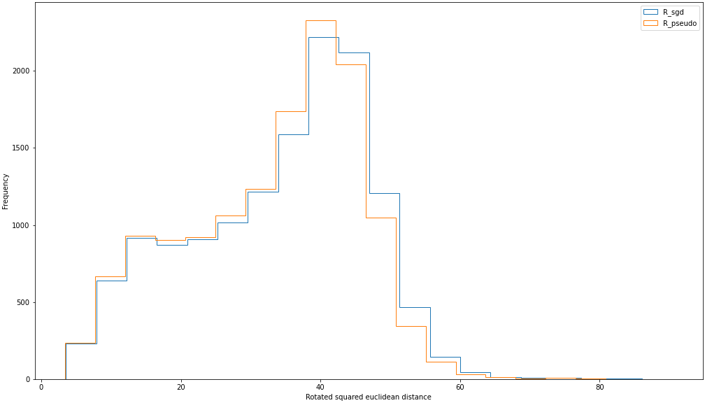

# Embedded Understanding

Research project carried out by Thyge Enggaard under the supervision of Sune Lehmann and Morten Axel Pedersen. 

## About this project
The central tenet of this project is that while there might be no such thing as a (completely) private language, all 'points' of understanding are somewhat unique. This is the case whether one compares two or more persons or the 'same' person at different points in chronological time. At the scale of multiple persons, groups of relatively similar understanding might arise. If this is the case, how would we be able to elicit and interpret these differences in understanding?   

In this project, I will attempt to utilize word embeddings to elicit such differences. The embedding of text in a vector space captures relations between words as they are used in a corpus. If we distinguish between direct association (e.g. the words 'blue' and 'sky' being used in succession) and structural equivalence (e.g. the word 'cat' and 'dog' being relatively interchangeable), word embeddings in particular seem to capture the latter.

By comparing embeddings from different corpora, embeddings might help us elicit which words that have the largest (and smallest) discrepancies in terms of their structural equivalences between corpora. 

## Data

To explore various ways in which such patterns might be elicited, I currently apply my ideas to two corpuses, consisting of all comments in the subreddit r/Republican and r/Democrats respectively.

## Analysis so far

### Pre-processing of comments
TO DO
* Identify groups of comments with high similarity (e.g. TF-IDF) and remove if they are from bots 

Most notably, I add the part-of-speech (POS) tag to each word. This partly helps reduce problems of polysemy (e.g. 'back' as noun ('my back hurts' and 'back' as adverb (the room is at the back of the house)), and further allow me to study whether certain word-types have larger discrepancies than others.  

  
### Embedding
Initially, I create static embeddings (each word has a fixed vector). Dynamic embeddings (e.g. BERT) would be better suited to alleviate the problem of polysemy, but comparing word-types between corpuses seem more difficult.

For now, I use skip-gram with negative sampling (word2vec) as implemented in the Gensim-library.

### Approaches to comparing corpora
Word embeddings allow for multiple ways of comparing corpora. At a broad level, two approaches can be distinguished:
1. Direct comparison: Aligning the embedded space to a shared space, in order to directly compare word
1. Indirect comparison: Compare word based on comparing features of each embedding
    1. Global comparison: For each word, compare its distance to all other words between the two embeddings
    1. Local comparison: For each word, compare its neighboorhodd, e.g. the overlap among the N nearest neighbors

### Results from direct comparison
TO DO
* Implement proper rotations (i.e. distance preserving / orthogonal)

To get a sense of this approach, I have initially applied two approaches to identify an optimal improper (non-distance preserving) rotation:
* Stochastic Gradient Descent (sgd): Adjust the rotation matrix according to the gradient of the mean squared euclidean distance between sampled words.
* Pseudo-inverse (pseudo): Applying the pseudo-inverse to solve the equivalent of an exact rotation

#### Distribution of squared euclidean distances
The two approaches generate very similar distributions of rotated distances.

#### Squared euclidean distance by POS-type
There is great within-POS variation in rotated distance - nouns and proper nouns are highest on average.

#### Squared euclidean distance by POS-type
Rotated distances is greater for words that are less frequent in the corpus. This seem to be an undesirable feature. 

#### Inspecting individual words
The 50 words with the largest difference are:
> ['ding_PROPN', 'boop_PROPN', 'vis_X', 'totesmessenger_PROPN', 'bloop_ADJ', 'faq_NOUN', 'drs_NOUN', '0aremindme_NUM', '0a_PROPN', 'helperbot_PROPN', 'bleep_ADJ', 'remindmebot_NOUN', 'yada_PROPN', 'yadda_PROPN', 'footer_NOUN', 'sort_ADJ', 'album_NOUN', 'gifs_NOUN', 'utc_NOUN', 'webpage_NOUN', 'spade_NOUN', 'borrower_NOUN', 'download_VERB', 'llc_PROPN', 'sneakpeekbot_PROPN', 'autotldr_NOUN', 'resubmit_VERB', 'blah_INTJ', '31b9fm_NUM', 'clickablelinkbot_NOUN', '0anote_X', 'darkness_NOUN', 'queer_NOUN', 'realdonaldtrump_NOUN', 'sachs_PROPN', '31bfht_ADJ', 'chrome_PROPN', 'arlington_PROPN', 'thurmond_PROPN', 'jul_PROPN', 'lago_PROPN', 'jacobs_PROPN', 'ba_PROPN', 'bain_PROPN', 'intensity_NOUN', 'oecd_PROPN', 'fy_PROPN', '3a_PROPN', 'cloture_NOUN', 'v1_NOUN']

The 50 words with the smallest difference are:

